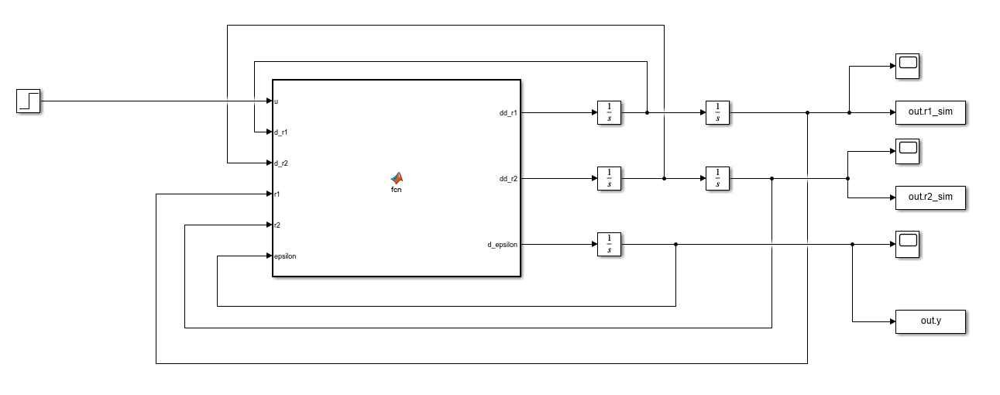
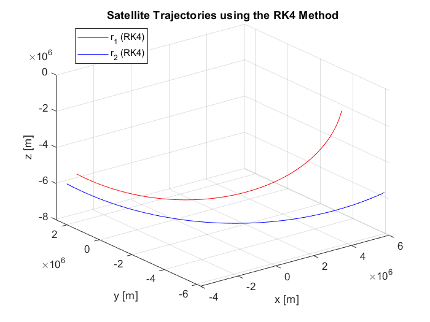
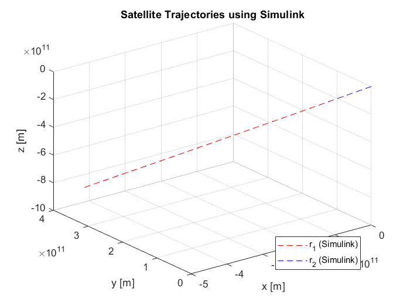
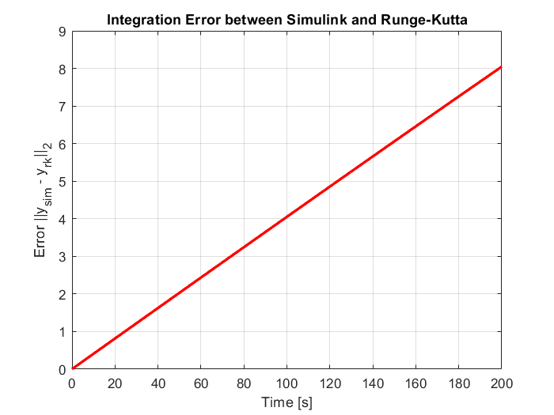
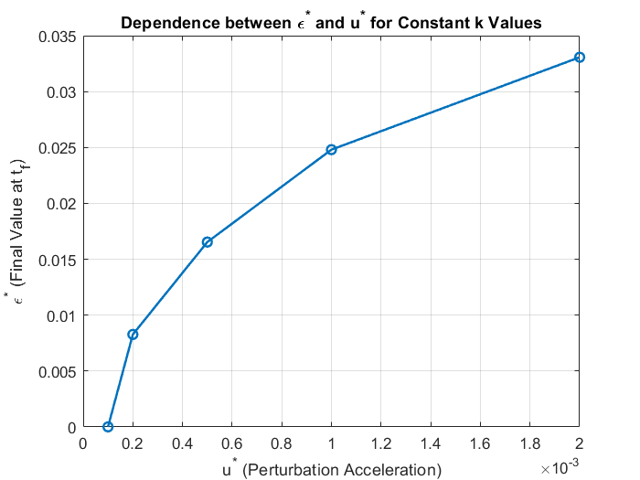
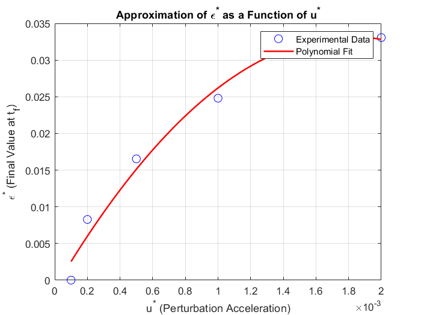
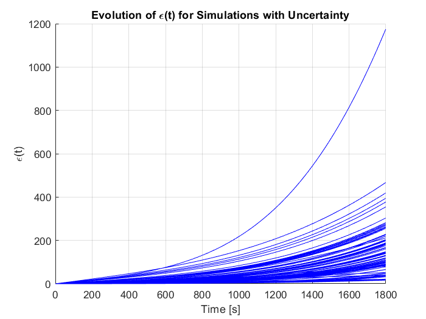
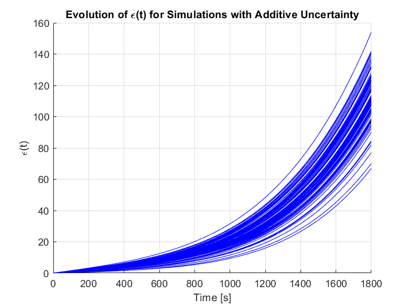
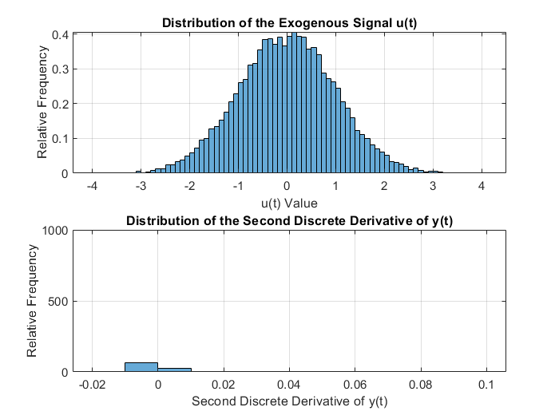

# OrbitTracker - Documentation
The project produces graphs that visualize satellite trajectories and integration errors between the RK4 and Simulink methods. It also analyzes uncertainties in the initial positions and the probability that they exceed a predetermined threshold. <br>
Project made by Alexandru Oancea <br>
Date: January 2025 <br>

## Model description
Let the position vector $\mathbf{r}(t) = [x(t) \quad y(t) \quad z(t)]^T$. Then the motion of a satellite orbiting the Earth can be approximated by the solution of the system of differential equations:

```math
\ddot{{r}}(t) =
- \frac{GM_\oplus}{\|{r}\|_2^2} \frac{{r}}{\|{r}\|_2}
- \frac{3}{2} J_2 GM_\oplus \frac{R_\oplus^2}{\|{r}\|_2^{5}}
\left[
\begin{array}{c}
    \frac{x - 5xz^2}{\|{r}\|_2^2} \\[10pt]
    \frac{y - 5yz^2}{\|{r}\|_2^2} \\[10pt]
    \frac{3z - 5z^3}{\|{r}\|_2^2}
\end{array}
\right]
+ \omega_\oplus^2 \left[
\begin{array}{c}
   x \\ 
    y \\
    0
\end{array} \right]
+ 2\omega_\oplus 
\left[
\begin{array}{c}
    \dot{y} \\ 
    -\dot{x} \\ 
    0
\end{array} \right] = g(t, {r}(t), \dot{{r}}(t))

```

```math
{r}(t_0) ={r_0}; \dot{{r}}(t_0) = \dot{{r_0}}

```
To avoid the need for explicit transformations of the reference system, the equation of motion is
expressed in the fixed and rotating Earth frame of reference. Consequently, the centrifugal
and Coriolis terms are taken into account in the modeled acceleration. The constants have the values ​​in the table below.
| Simbol  | Semnificație                             | Valoare                 | Unitate          |
|---------|-----------------------------------------|-------------------------|------------------|
| *G*     | Constanta gravitațională universală    | 6.674 · 10⁻¹¹           | Nm²kg⁻²         |
| *Mₑ*    | Masa Pământului                        | 5.972 · 10²⁴            | kg              |
| *Rₑ*    | Raza Pământului                        | 6,371,000               | m               |
| *J₂*    | Coeficient gravitațional               | 1.08262668 · 10⁻³       | -               |
| *ωₑ*    | Viteza unghiulară a Pământului         | 7.2921 · 10⁻⁵           | rad·s⁻¹         |

### Reference
Teunissen, P.J. and Montenbruck, O. eds., 2017. Springer handbook of global navigation satellite
systems (Vol. 10, pp. 978-3). Cham, Switzerland: Springer International Publishing.

### Model
The model is represented by two satellites orbiting the Earth, with position vectors ${r_1}(t)$ and ${r_2}(t)$, being described by the system of equations below:
```math
$$
\ddot{{r_1}}(t) = g(t, {{r_1}}(t), \dot{{r_1}}(t)) + u(t)
$$

$$
\ddot{{r_2}}(t) = g(t, {{r_2}}(t), \dot{{r_2}}(t))
$$

$$
\dot{\varepsilon}(t) = \frac{\| {{r_1}(t) - {r_2}(t) } \|_2}{\| {r_2}(t)\|_2}
$$

$$
y(t) = \varepsilon(t)
$$
```
The exogenous signal $u(t) = k \cdot 10^{-3} \cdot 1(t)$ represents a perturbing acceleration with a constant value $k$, chosen. <br>
The initial conditions are:
```math
$$
{r_1}(t_0) = 10^6 \cdot 
\begin{bmatrix} 
-3.111567646661099 \\ 
2.420733547442338 \\ 
-5.626803092595423 
\end{bmatrix}
$$

$$
{r_2}(t_0) = 10^6 \cdot 
\begin{bmatrix} 
-3.422732421327209 \\ 
2.662806902186572 \\ 
-6.18948308151366 
\end{bmatrix}
$$

$$
\dot{{r_1}}(t_0) = 10^3 \cdot 
\begin{bmatrix} 
4.953572247000772 \\ 
-3.787243278806948 \\ 
-4.362500902062312 
\end{bmatrix}
$$

$$
\dot{{r_2}}(t_0) = 10^3 \cdot 
\begin{bmatrix} 
5.448929471700850 \\ 
-4.165967606687643 \\ 
-4.798750992268544 
\end{bmatrix}
$$
```
## Analysis and Interpretation
### Stage 1
The first requirement for carrying out the project is to choose an initial condition.
```math
\varepsilon_0 = 0.05; 
```
### Stage 2
Creating the model in Simulink using Integrator and Matlab function blocks. We considered a Matlab function block to simulate the system of equations that describe the model. For the input $u(t)$ we initially considered a Step block with the associated value $u(t)=2 \cdot 10^{-3} \cdot 1(t)$. Also, for each of the Integrator blocks we added the initial conditions. The model in the _SimulinkFileModel.slx_ file is represented in the figure below.

### Stage 3
Writing the system in the form of $1^{st}$ order differential equations:
```math
$$
\dot{x} =
\begin{bmatrix}
\dot{{r_1}}(t) \\
\ddot{{r_1}}(t) \\
\dot{{r_2}}(t) \\
\ddot{{r_2}}(t) \\
\dot{\varepsilon}(t)
\end{bmatrix}
=
\begin{bmatrix}
\dot{{r_1}}(t) \\
g(t, {{r_1}}(t), \dot{{r_1}}(t)) + u(t) \\
\dot{{r_2}}(t) \\
g(t, {{r_2}}(t), \dot{{r_2}}(t)) \\
\frac{\| {{r_1}(t) - {r_2}(t) } \|_2}{\| {r_2}(t)\|_2}
\end{bmatrix}
\in \mathbb{R}^{13 \times 1}
$$
```
### Stage 4
Solving the differential system $\dot{x}(t) = f(t,x(t))$ using the fourth-order Runge-Kutta method. We consider the integration step $h=1$ second, the input $F_m(t)=0$ and the time interval $t \in [0;1800]$.
### Stage 5
Illustrating the satellite orbits on the same graph, using the same initial conditions. The results obtained are represented in the graphs below. The results are similar. Unfortunately, due to the format of the numbers within the Simulink model, the graph is resized with zoom in resulting in a different appearance. <br>


### Stage 6
Evaluation of the integration error, performing both model simulation and the Runge-Kutta method. The integration error was calculated as the norm 2 of the difference obtained at each time point. The result obtained is represented in the graph below. The graph shows a linear increase in error during the simulation. The Runge-Kutta method uses a constant integration step, and Simulink adjusts the step dynamically, these differences can contribute to the accumulation of error. <br>

### Stage 7
Illustration of the dependence $\varepsilon^{\ast}(u^{\ast})$ at the final time $t_f$, the maximum time instant considered in the simulation. The result obtained is represented in the graph below. The evolution suggests a proportionality between the perturbative acceleration and the final value of the relative error, at least for higher values ​​of k. On the other hand, the graph suggests that the system is more sensitive to small perturbations. <br>

### Stage 8
Determining the approximation polynomial using the previously calculated values, determining the coefficients that best fit these coordinates. The graphical result indicates that the chosen polynomial provides an adequate description of the relationship between $\varepsilon^{\ast}$ and $u^{\ast}$. <br>

### Stage 9
We consider a multiplicative uncertainty of the initial position $\({r}_2(t_0)\)$ given by the relation
```math
$$
\tilde{{r}}_2(t_0) = (1 + \alpha) \cdot{r}_2(t_0),
$$
```
where $\(\alpha \sim \mathcal{N}(0, 0.1)\)$ is a scalar. <br>
Graficul de mai jos arată că sistemul devine mai sensibil la anumite condiții inițiale, iar eroarea tinde să crească exponențial în timp, ceea ce sugerează o divergență tot mai mare între sateliți din cauza acumulării incertitudinii. <br>

### Stage 10
We consider an additive uncertainty of the initial position $\({r}_2(t_0)\)$ given by the relation
```math
$$
\tilde{{r}}_2(t_0) = (\alpha) + {r}_2(t_0),
$$
```
where $\(\alpha_{i} \sim \mathcal{N}(0, 5), i=1:3\)$. We will analyze the behavior of $y(t)$ in 100 simulations using this uncertainty. <br>
The graph below shows that due to the additive nature of the uncertainty, the spread of error values ​​is more uniform and concentrated, unlike the multiplicative uncertainty, where the divergence was more pronounced. Thus, additive uncertainty leads to an increase in the distance between satellites, but in a more controlled way compared to the multiplicative case. <br>

### Stage 11
Analysis of the distribution of the exogenous signal and the second derivative of the output assuming that u(t) has a normal distribution. <br>
The graph shows us a symmetric histogram around the value 0, specific to a normal distribution $\mathcal{N}(0, 1)$ and shows that the exogenous signal has the highest probability of taking values ​​close to the mean (0), and the probability decreases as we move away from it. Also, in the distribution of the second discrete derivative of the output, values ​​are much more concentrated around a small positive value, so it indicates that the output, even if influenced by the exogenous signal u(t), has a more controlled dynamics. <br>


## Conclusion 
Both methods used, the 4th order Runge-Kutta method (RK4) and the Simulink simulation, provided consistent results in modeling satellite motion, with minor differences between them, confirming the accuracy of the implementations. <br>
The integration error between the numerical methods and Simulink, calculated by the 2-norm, showed that the Runge-Kutta method is sufficiently accurate for the simulations performed. Thus, the RK4 method can be successfully used for fast simulations, without resorting to Simulink. <br>
Simulations with uncertainties (multiplicative and additive) have highlighted that the initial position of the satellites can significantly affect the final trajectory. This analysis is useful to better understand the variability in satellite motion in the presence of perturbations. <br>

### Improvements and extensions
+ *Improved Accuracy:* Implementing a variable-step integration method could reduce numerical errors during critical phases without significantly increasing simulation time.
+ *External Influences:* Adding gravitational effects from other celestial bodies, such as the Sun and Moon, could make the simulations more realistic for long-term orbit predictions.
+ *Control System Integration:* Extending the model to include satellite control systems that adjust trajectories in real-time based on detected perturbations would make the simulations more practical for space engineering applications.

__Thank you!__ <br>

Project made by Alexandru Oancea <br<
Email: alexandruoancea49@gmail.com
